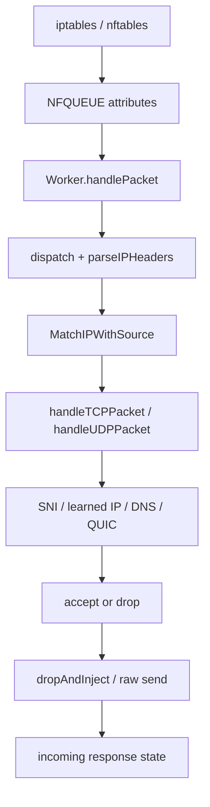

# B4 1.73 — baseline packet classification and injection path audit

## Audit/assumptions

Audit выполнен для форка `AlexZander85/b4`, ветки `main`, на базовом commit
`7160ee8f066bbbed1c713b4d0114db4e8acbc882` (B4 `1.73.0`). Нормативными
источниками были только `B4_FORK_ARCHITECTURE.md` редакции 2.3 и
`B4_FORK_PATCH_PLAN.md` редакции 2.3. Старые архитектурные документы и
reference repositories в этом этапе не использовались.

Проверен фактический Go-код в `src/`, генераторы iptables/nftables, NFQUEUE,
TUN, DNS, matcher, runtime state, Discovery/Watchdog и HTTP API. Проверка
реального Keenetic/Entware kernel path, hardware flow offload и доступности
`nfnetlink_queue` на target host в этом окружении невозможна: это остаётся
обязательным target-side gate для capture этапа.

Рабочее дерево до audit было чистым. Audit не меняет production runtime,
конфигурацию или набор стратегий.

## Files changed

- `docs/audit/b4-1.73-flow-path.md` — этот audit.

Изменений в `src/` нет.

## Design and invariants

### Фактический call graph



Точки входа и переходы:

1. `tables.AddRules` выбирает nftables или iptables backend
   (`src/tables/common.go:27-43`). Оба backend используют NFQUEUE с `bypass`:
   nftables — `src/tables/nftables.go:122-127`, iptables —
   `src/tables/iptables.go` через `buildNFQSpec`.
2. В NFQUEUE worker создаются raw senders с `Queue.Mark` и
   `Queue.Mark|engine.ClientMark`, очередь имеет `MaxPacketLen=0xffff` и
   `MaxQueueLen=4096` (`src/nfq/nfq.go:62-118`).
3. Callback принимает packet payload, проверяет только точное равенство
   `a.Mark == Queue.Mark`, проверяет interface и вызывает `dispatch`
   (`src/nfq/handler.go:39-66`).
4. `dispatch` разбирает IPv4/IPv6, затем сразу делает
   `matcher.MatchIPWithSource` и выбирает TCP/UDP handler
   (`src/nfq/handler.go:68-96`).
5. TCP path последовательно проверяет learned IP, port, packet-local TLS SNI,
   routing/block/RST/escalation и только затем решает `accept` либо generic
   drop/inject (`src/nfq/handler.go:198-243`, `334-376`, `451-577`).
6. UDP path отдельно обрабатывает DNS, затем learned IP, port и packet-local
   QUIC SNI (`src/nfq/handler.go:580-649`). DNS matcher и routing находятся в
   `src/nfq/dns.go:81-245`.
7. Generic action выполняется после `vc.drop()` в отдельной goroutine на
   каждый packet (`src/nfq/handler.go:545-574`), а `dropAndInjectTCP` сам
   выбирает mutation/desync/fake/fragmentation strategy и raw-sends
   (`src/nfq/nfq.go:177-243`). Это не является отдельными
   `ClassificationDecision`, `ActionPlan` и idempotent executor.
8. Server-side TCP path использует `HandleIncoming` и `connStateTracker`; state
   keyed by textual 4-tuple stores a `*config.SetConfig`
   (`src/nfq/connstate.go:12-23`, `395-425`, `504-517`).

### Kernel capture envelope

| Направление/событие | Фактическая видимость | Оценка v2.3 |
|---|---|---|
| Outgoing TCP на configured dport | `connbytes original 0:N`, default global `N=19` | Есть ограниченный first-N, но нет formal envelope/FSM metadata |
| Incoming TCP на configured sport | `connbytes reply 0:N` плюс отдельные SYN-ACK и RST rules | SYN-ACK/RST видимы; FIN не выделен отдельным правилом |
| Outgoing/Incoming DNS | dport 53 и sport 53 queue rules | Есть, но DNS evidence не оформляется как source-scoped hint |
| Outgoing UDP target ports | `connbytes original 0:N`, default global `N=8` | QUIC Initial может быть видим, incoming QUIC lifecycle не формализован |
| Duplicate-IP TCP | отдельное правило queue всех TCP packets | Обходит first-N и требует отдельной budget/idempotency политики |
| Generated packets | mark-based return/accept path существует | Марки частично разнесены, но нет единого provenance contract/resolver |
| IPv4 | NFQUEUE parser/action path существует и включён по умолчанию | Видимость зависит от rules и queue readiness |
| IPv6 | NFQUEUE path существует, default `ipv6=false` | В TUN `forwardPacket` IPv6 всегда считает dropped и возвращает |

Rules используют `queue ... bypass`, поэтому отсутствие userspace queue
может выглядеть как нормальный direct path. Это соответствует fail-open только
как аварийное поведение, но не доказывает readiness и не создаёт диагностику
“capture unavailable”. В коде нет обязательной проверки владельца очереди,
первых counters после установки rules и hardware flow-offload bypass.

### P0 — clean SYN нарушает нормативный invariant

В `handleTCPPacket` explicit SYN technique выделена отдельно:

```text
is SYN && !ACK && needsTCPSynInjection(set)
    -> explicit fake SYN/MD5 + raw original + drop
```

Это ветка `src/nfq/handler.go:267-320`.

Но после неё остаётся generic ветка:

```text
matched && !routeTProxy && needsTCPInjection(set)
    -> vc.drop()
    -> dropAndInjectTCP(packet)
```

Она находится в `src/nfq/handler.go:541-574`. `needsTCPInjection` становится
`true` от Faking.SNI, SNIMutation, desync, window или fragmentation
(`src/nfq/handler.go:99-112`), тогда как `needsTCPSynInjection` для обычного
Faking.SNI остаётся `false` (`src/nfq/handler.go:114-121`).

У SYN без payload `dropAndInjectTCP` всё равно делает raw send
(`src/nfq/nfq.go:177-192`). Следовательно, matched clean SYN с Faking.SNI или
fragmentation может быть dropped и raw-reinjected без explicit SYN technique,
вместо обязательного `NF_ACCEPT`. Это прямой blocker для Stage 7 и для
первого Android TCP flow.

Patch point: guard перед generic drop в `handleTCPPacket`; правильный fix
должен быть отдельным Stage 7 change с regression fixture, а не workaround в
strategy selector.

### P0 — classifier видит только один NFQUEUE packet

TLS parsing вызывается как
`sni.ParseTLSClientHelloSNI(payload)` (`src/nfq/handler.go:334-363`). TCP
sequence, direction, retransmission, out-of-order ranges, overlap и FIN state
не участвуют в выборе host. Для Android ClientHello split `1396 + remainder`
первый packet может не содержать SNI, после чего flow получает только fallback
по IP/port/learned state. `tlsInfoCache` хранит уже найденный host по textual
connKey, но не собирает отсутствующий host из следующих sequence offsets
(`src/nfq/connstate.go:25-86`).

Patch points: новый classifier/TCP FSM layer между `parseIPHeaders` и existing
action path; current packet-local parser должен остаться bounded parser, но не
быть final verdict для `Partial`/`Ambiguous`.

### P0 — learned IP не соответствует source-scoped evidence и absolute TTL

`SuffixSet.learnedIPCache` имеет ключ только destination IP и хранит один
`domain`/`*config.SetConfig` на IP (`src/sni/match.go:48-68`, `420-456`).
`MatchLearnedIPWithSource` применяет source-device filter уже после извлечения
единственной записи, но source IP/MAC/ifindex/VLAN не входят в ключ
(`src/sni/match.go:690-738`). Для shared Google/CDN IP последняя запись может
заменить предыдущую (`src/sni/match.go:433-438`).

TTL сейчас 10 минут, а lookup обновляет `entry.learnedAt` и LRU
(`src/sni/match.go:487-497`, `719-738`). Это sliding lifetime, а не
`ExpiresAt = min(record TTL, configured cap, source cap)`. Значит, частые
попадания могут удерживать устаревшее DNS-derived evidence дольше допустимого.

Дополнительный config-generation риск: learned entry хранит mutable
`*config.SetConfig`, а `connInfo` также возвращает такой pointer для incoming
path. `Pool.UpdateConfig` атомарно меняет worker config, но не превращает
долгоживущий flow state в immutable `{SetID, ConfigGen}`
(`src/nfq/pool.go:199-233`).

Patch points: `HostHintStore` с `ClientKey + DestinationIP + L4Proto`, absolute
expiry, candidate list, bounded deterministic eviction, `SetID/ConfigGen` и
revalidation against current snapshot. Existing learned matcher оставить
только compatibility fallback с явно низкой confidence.

### P0 — DNS не создаёт доказательство для первого flow

Обычный DNS query матчит domain/source MAC и при routing сохраняет только
pending route `{tuple, txid, domain, setID}` (`src/nfq/dns.go:81-141`). DNS
response парсит только A/AAAA, затем вызывает routing callback
(`src/nfq/dns.go:196-241`). `src/dns/dns.go:8-35` читает один QNAME, а
`ParseResponseIPs` читает A/AAAA/TTL field без structured TTL/CNAME/HTTPS/SVCB
evidence (`src/dns/dns.go:78-135`).

DoH проходит через тот же matched-set redirect path
(`src/nfq/dns.go:144-190`, `248-306`), но результат не попадает в отдельный
source-scoped evidence store. При DoH/system DNS и shared IP нет общего
`ClientKey`-scoped handoff до первого TCP/QUIC payload.

Patch points: structured DNS event, source identity resolution, HostHintStore,
DNS HTTPS/SVCB/ECH metadata и explicit DNS→TCP/QUIC correlation. Не расширять
Google CIDR как замену этому пути.

### P1 — action selection не отделён от classification и не idempotent

Сейчас один handler меняет `matched/set`, применяет routing/block/escalation и
затем сам запускает action. `ActionToken`, stream offset, first-flight state и
“action already emitted” отсутствуют. Retransmitted bytes, пока kernel rule
оставляет packet в first-N window, снова доходят до generic drop/inject. В
частности, `RecordClientHello` считает retransmits только для IP-block/
escalation (`src/nfq/connstate.go:140-163`), но не подавляет повторную
fake/split sequence.

Кроме того, `src/nfq/handler.go:564-573` создаёт goroutine на каждый generic
action, что противоречит требованию “no goroutine per packet” для production
hot path. На pressure очередь получает fail-open bypass, но userspace action
budget/active count не описан.

Patch points: после classifier добавить immutable `ClassificationDecision`,
затем stream-offset `ActionPlan`, token store и bounded executor. Временно
сохранить existing strategies behind legacy compatibility mode; новые Level C
strategies не добавлять.

### P1 — marks/provenance: частичный механизм без общего контракта

Существующие marks:

- main injected mark — `Queue.Mark`, default `0x8000`;
- Discovery flow — `Queue.Mark+1` по умолчанию;
- Discovery injected — `Queue.Mark+2`;
- TUN steer/client/reinject reserved bits — `0x40000000`, `0x20000000`,
  `0x10000000` (`src/engine/engine.go:3-7`, `src/config/methods.go:117-135`).

NFQUEUE callback bypasses only exact `a.Mark == Queue.Mark`
(`src/nfq/handler.go:49-53`), while generated client packets use combined
marks and TUN rules use separate masks. nftables/iptables also use connmark
save/return when capability exists (`src/tables/nftables.go:233-256`,
`src/tables/iptables.go:601-610`). Это рабочая совместимость, но не
versioned processed-provenance envelope: нет единого mask/type/producer
resolver, который доказывает, что injected/replayed/modified packet никогда
не возвращается в B4 queue во всех backend/path combinations.

Patch point: Stage 4 `capture/marks.go` и envelope metadata. До его
реализации нельзя считать generated-packet invariant доказанным на Keenetic.

### P1 — direction/source identity неполна

NFQUEUE attribute `InDev/OutDev` используется только для фильтра интерфейса
(`src/nfq/iface.go:32-56`). `pktInfo` хранит source/destination IP и MAC, но
не сохраняет ifindex/VLAN в flow key (`src/nfq/handler.go:27-37`,
`123-195`). MAC обычно берётся из `ipToMac` (`src/nfq/nfq.go:454-460`), а в
TUN source attribution зависит от readable `/proc/net/nf_conntrack`; при
ошибке код прямо предупреждает, что будет виден uplink address
(`src/nfq/pool.go:31-46`). Это недостаточно для нормативного `ClientKey`
`L3Family + SourceIP + SourceMAC + IfIndex + VLAN`.

Patch point: capture envelope/direction resolver и immutable ClientKey; при
неполной identity flow должен понижать confidence/fail-open, а не смешиваться
с другим клиентом.

### P1 — IPv4/IPv6 и TUN divergence

NFQ parser поддерживает IPv4 и часть IPv6 extension headers, но отбрасывает
IPv4 fragments и IPv6 Fragment header (`src/nfq/handler.go:131-177`). IPv6
выключен default config (`src/config/config.go:184-191`). В TUN mode
`forwardPacket` для любого IPv6 пакета увеличивает `v6DropCount` и возвращает
(`src/tun/tun.go:259-278`). Поэтому “IPv4/IPv6 correctness” не доказана для
Android path; TUN IPv6 сейчас не является production-compatible fallback.

### P1 — readiness/offload и first-N capture не проверяются на target

`nfqueue.Open` и callback registration подтверждают только открытие userspace
handle (`src/nfq/nfq.go:77-118`). `tables` загружает модули и ставит rules,
но не делает обязательный self-check `queue owner + counters + reinjection
visibility + offload bypass`. В trace-only режиме iptables выводит
`/proc/net/netfilter/nfnetlink_queue`, однако это диагностический лог после
apply, а не gate (`src/tables/iptables.go:767-780`).

TUN умеет probe `xt_connbytes`; при отсутствии match capability переключается
на capture всего default route (`src/tun/capture.go:26-49`). Это безопаснее
потери пакетов, но на Keenetic может нарушить CPU/memory budget и не оформлено
как bounded classifier capture profile.

Target-side acceptance still required:

- queue owner/PID и queue drops;
- first-N counters для outgoing/incoming TCP, FIN/RST, DNS и QUIC Initial;
- flow-offload disabled or proven bypass for B4 capture;
- generated-mark packet counters показывают нулевой повторный enqueue;
- both IPv4 and IPv6 test flows.

### P1 — config apply, shutdown and restart

Положительные стороны:

- `cfgPtr`/worker config обновляются atomic pointer-ом;
- `Pool.Stop` останавливает cleanup и workers;
- main shutdown останавливает Watchdog, Discovery, pool/TUN и очищает tables;
- TUN сохраняет и восстанавливает stale route/rp_filter state
  (`src/tun/state.go:25-105`, `src/tun/cleanup.go:11-77`).

Риски, которые нельзя считать transactional:

1. Watchdog сначала делает `pool.UpdateConfig`, затем `SaveToFile`, затем
   `cfgPtr.Store` (`src/main.go:390-418`). При ошибке persistence runtime уже
   изменён.
2. `Config.SaveToFile` пишет прямо через `O_TRUNC` в основной файл
   (`src/config/methods.go:17-46`), без temp+fsync+rename и без last-good
   manifest.
3. flow state, learned cache и connState живут в process runtime; при restart
   они не восстанавливаются, что безопасно для live evidence, но должно быть
   явно documented. Shared system artifacts (`/tmp/b4_sysctl_snapshot.json`)
   и TUN state требуют ownership/atomicity checks.
4. `tables.Clear` использует fixed 30 ms delay before chain removal
   (`src/tables/iptables.go:783-800`, `src/tables/nftables.go:361-384`), но
   не подтверждает отсутствие active queue consumers/marks.

Это не повод реализовывать rollback в Stage 1; patch points для него — Stage B
Productization, после classifier core.

### UI/API schema inventory

Существующий public config API:

- `ConfigResponse` возвращает embedded `config.Config`, set statistics,
  warnings и interface list (`src/http/handler/config_types.go:5-17`);
- queue schema содержит mode/start queue/threads/mark/IPv4/IPv6/connbytes,
  devices и TUN, но не classifier generation, phase, evidence, action token,
  hold/reassembly/feature flags (`src/config/types.go:73-96`);
- current API exposes sets, Discovery, Watchdog, capture, diagnostics and
  log trace; Watchdog returns operational domain status only
  (`src/http/handler/watchdog.go:21-56`, `src/watchdog/types.go:12-38`);
- Discovery JSON exposes presets/results and full `*config.SetConfig` in
  result structures (`src/discovery/types.go:59-115`), but no layered
  classifier verdict/causal failure stage or privacy-safe evidence export.

Stage 3/Level B must add compatibility-defaulted v2.3 schema and explicit
observe-only diagnostics. Do not expose raw payloads, client identifiers or
live mutable flow pointers through the API.

## Tests added

Нет. Stage 1 по plan — audit-only; fixtures и regression tests начинаются с
Stage 2. Это намеренно предотвращает переход к новой реализации до фиксации
baseline.

## Commands/results

| Команда | Результат |
|---|---|
| `git status --short --branch` | чистая базовая ветка до создания audit; после audit изменён только этот файл |
| `git ls-remote --heads origin` | у fork есть `main`, указывающий на базовый commit v1.73.0 |
| `go test ./...` из `src/` | не запущен: `go: command not found` (`exit 127`) |
| `go test -race ./...` из `src/` | не запущен: `go: command not found` (`exit 127`) |

Unit/integration/race acceptance Stage 1 не может считаться зелёным до
появления Go toolchain. Runtime kernel tests также требуют target Keenetic и
не могут быть заменены тестовой страницей или расширением CIDR.

## Benchmarks/resource bounds

В baseline уже есть некоторые hard caps, но они не образуют v2.3 envelope:

- NFQUEUE: `MaxPacketLen=65535`, `MaxQueueLen=4096`;
- matcher caches: IP/domain по 2000, learned IP 5000;
- TLS cache: 20000;
- conn state: 10000;
- dest state: 10000 IP-block, 5000 blocked/escalation/RST caches;
- cleanup interval worker: 30 s, большинство flow state TTL: 120 s.

Проблемы bounds:

- learned cache entries содержат mutable config pointers и sliding TTL;
- no per-client/per-flow HostHint budget;
- generic action запускает goroutine на packet;
- duplicate-IP path queue all packets;
- TUN fallback при отсутствии `xt_connbytes` может захватить весь default
  route;
- no metrics for reassembly bytes, held packets, action tokens, provenance
  requeue, queue drops or offload suspicion.

Точный CPU/RAM budget для Keenetic нельзя подтвердить без target profile,
kernel version, enabled IPv6/offload и Android corpus. Это обязательная
предпосылка Stage 4/14/16, но не workaround для audit.

## Compatibility/migration

Stage 1 не изменяет config schema и не требует migration. Текущий sparse
config version (`CurrentConfigVersion=51`) остаётся legacy baseline.

Рекомендуемый compatibility contract для следующих stages:

1. добавить отдельный classifier-v2 schema/generation и feature flags с
   defaults `off/observe`, не менять legacy strategy semantics;
2. flow/evidence state хранит `SetID`, `StrategyID` и `ConfigGen`, не
   `*config.SetConfig`;
3. legacy learned-IP fallback пометить low-confidence и ограничить absolute
   TTL;
4. activation/reload делать через prepare → validate → atomic runtime swap →
   persist last-good, а failure возвращать старый generation;
5. new hold/reassembly/action path по умолчанию disabled until target capture
   readiness passes.

## Risks and follow-up

### Stage 1 acceptance status

Audit deliverable выполнен и фактические patch points зафиксированы. Однако
production readiness status — `NO-GO`:

- clean SYN invariant нарушен;
- source-scoped DNS/QUIC/learned evidence отсутствует;
- bounded sequence-aware reassembly отсутствует;
- action idempotency/provenance не доказаны;
- target kernel/offload readiness не измерены;
- baseline Go tests заблокированы отсутствующим toolchain;
- TUN IPv6 path несовместим с требованием IPv4/IPv6 correctness.

### Разрешённая последовательность после audit

1. Stage 2: добавить только deterministic fixtures и baseline tests для
   clean SYN, packet-local/split TLS, DNS, QUIC, IPv4/IPv6 и mark behavior.
2. Stage 3: config generation/feature flags/test clock с legacy-safe defaults.
3. Stage 4: capture envelope, marks, queue readiness/offload diagnostics на
   реальном target.
4. Затем Core stages в порядке patch plan. До Core/Productization gates не
   добавлять новые fake/split/disorder strategies.

Переход к Stage 2 в текущей рабочей копии безопасен только как test-only
изменение. Переход к runtime fix требует сначала восстановить Go toolchain и
провести target-side capture readiness check; иначе acceptance criteria будут
непроверяемыми.

## Proposed commit(s)

```text
docs(audit): map B4 packet classification and injection paths
```

Фактический commit не создавался; в рабочем дереве подготовлен только audit
файл для review.
