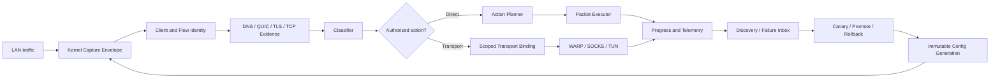

# B4X

> **Enhanced Adaptive B4 Fork**  
> Точная классификация. Безопасная адаптация. Автоматическое восстановление доступа.

**B4X** — независимый расширенный форк [B4](https://github.com/DanielLavrushin/b4), ориентированный на устойчивую работу DPI-обхода на маршрутизаторах, прежде всего Keenetic/Entware.

Проект сохраняет знакомые sets, strategies и packet-level техники B4, но перестраивает критический runtime вокруг точной классификации flow, изоляции сервисов, ограниченных ресурсов, транзакционного применения конфигурации и автоматической проверки на реальном клиенте.

> [!IMPORTANT]
> B4X не является официальной версией B4. README описывает целевую архитектуру форка. Конкретная функция считается готовой к production только после прохождения собственных implementation, router и real-device release gates.

## Зачем нужен B4X

В сложных сценариях проблема часто возникает **до применения стратегии**:

- Android открывает первый TCP/QUIC flow раньше, чем B4 получает достаточное доказательство домена;
- ClientHello оказывается разделён между несколькими TCP-сегментами;
- ECH скрывает внутренний SNI;
- один IP обслуживает YouTube, Gmail, Google Feed и другие сервисы;
- аппаратный offload уводит часть соединения из NFQUEUE;
- соединение зависает без явного RST или HTTP-ошибки;
- стратегия работает на тестовом запросе, но нестабильна в реальном приложении.

B4X исправляет не отдельный параметр split/fake, а весь путь принятия решения:

```text
packet capture
→ client/flow identity
→ DNS, QUIC, TLS and TCP evidence
→ classification and authorization
→ bounded ActionPlan or scoped transport binding
→ execution
→ progress verification
→ canary, promote or rollback
```

## Чем B4X отличается от B4 1.73.0

| Область | Базовый B4 1.73.0 | B4X |
|---|---|---|
| Первый flow | Решение во многом зависит от данных текущего пакета и ранее изученного IP | Source-scoped DNS/QUIC evidence связывается с первым flow конкретного клиента |
| Split ClientHello | Packet-local TLS parsing не гарантирует полный SNI | Bounded sequence-aware TCP reassembly собирает логический ClientHello |
| ECH | Внутренний SNI недоступен | Flow классифицируется по свежим DNS/QUIC hints без попытки «расшифровать ECH» |
| Shared IP/CDN | IP-match может оказаться слишком широким | IP/CIDR создаёт только `CaptureCandidate`; действие требует точного `ActionAuthorization` |
| Изоляция сервисов | Один client scope не исключает влияние между сервисами одного телефона | YouTube strategy не должна затрагивать Gmail, Google Feed и другой same-client traffic |
| TCP lifecycle | Packet strategy может не иметь полной модели состояния соединения | Явный TCP FSM, clean-SYN invariant, server progress и bounded cleanup |
| Повторные передачи | Повторный ClientHello может повторно активировать side effects | Один logical first flight получает один idempotent `ActionToken` |
| GSO | Представление пакета может менять classifier/executor path | Один логический ClientHello получает одинаковое решение в GSO и MSS layouts |
| Аппаратный offload | Для диагностики часто приходится отключать offload шире необходимого | Native Keenetic PPE per-flow exclusion удерживает только handshake window на CPU |
| RST-защита | Ограниченные diagnostics | Passive RST observation с evidence budget, conservative enforcement и rollback |
| Подбор стратегий | Ручной перебор или отдельные тесты | Isolated Discovery sandbox, adaptive probes, ranking, canary, last-good и rollback |
| Альтернативный маршрут | Внешний proxy/TUN требует отдельной настройки | Встроенный scoped Cloudflare WARP/MASQUE transport без отдельной установки `usque` |
| «Тихие» зависания | Timeout сам по себе мало объясняет | Progress accounting, false-positive suppression, differential proof и scoped recovery |
| Пользовательский интерфейс | Пользователь работает преимущественно с sets и strategies | Service Profiles, transport profiles и beginner workflow с сохранением expert mode |
| Проверка результата | Один успешный HTTP-запрос может скрыть регрессии | Automated router + Android field tests с negative controls и hard gates |

## Ключевые улучшения

### 1. Точная классификация первого соединения

B4X вводит явную модель:

```text
ClassificationPhase
+ EvidenceSource
+ Confidence
+ ClientKey
+ FlowKey
+ ConfigGeneration
```

Она позволяет связать DNS и QUIC-наблюдения с первым TCP/UDP flow конкретного устройства, а не записывать глобальное правило вида «этот IP относится к одному домену».

Поддерживаются:

- source-scoped `HostHintStore`;
- DNS A/AAAA, CNAME, HTTPS/SVCB и ECH metadata;
- QUIC-to-TCP handoff;
- positive и negative evidence;
- ambiguity handling;
- deterministic TTL и bounded eviction;
- fail-open при недостатке доказательств.

Практический результат: стратегия может применяться уже к первому YouTube API/UI/video flow, не ожидая случайного последующего соединения с доступным SNI.

### 2. Bounded TCP ClientHello reassembly

Большой Android ClientHello часто не помещается в один TCP-сегмент. B4X собирает его в ограниченной памяти с учётом:

- sequence numbers;
- out-of-order segments;
- exact retransmissions;
- identical и conflicting overlaps;
- coalesced TLS records;
- sequence wrap;
- timeout и memory budgets.

Complete reassembled SNI становится полноценным classifier evidence. Malformed, conflicting или incomplete stream не разрешает destructive action: held packets освобождаются без изменения.

### 3. Cross-service isolation

B4X разделяет два понятия:

```text
CaptureCandidate
≠
ActionAuthorization
```

IP, CIDR, ASN или порт могут быть причиной наблюдать flow, но не являются достаточным разрешением:

- применять fake/split/disorder;
- блокировать QUIC;
- активировать RST;
- записывать failure/escalation state;
- отправлять flow в proxy или WARP.

Authorization привязывается к точному client, flow, service component, domain evidence и config generation.

Для YouTube обязательными same-client negative controls являются Gmail и Google app/Discover. Успешное видео не считается корректным результатом, если trace показывает воздействие на другой сервис того же телефона.

### 4. Безопасный packet execution

B4X отделяет решение от исполнения:

```text
Evidence
→ ClassificationDecision
→ ActionPlan
→ Executor
```

Главные инварианты:

- обычный SYN без explicit SYN-technique всегда проходит неизменённым;
- packet mutation не запускается без classifier decision;
- ActionPlan использует абсолютные sequence-aware ranges и semantic markers;
- повторная передача тех же stream bytes не повторяет fake/split sequence;
- каждый generated packet получает provenance mark и не попадает в бесконечный re-entry;
- parser, queue, memory или timeout failure приводит к fail-open;
- все flow stores, buffers и leases имеют жёсткие limits и TTL.

### 5. Расширенный каталог стратегий

После завершения classifier и productization B4X добавляет безопасно интегрируемые strategy primitives:

- marker-based multisplit и multidisorder;
- host fake split;
- fake payload catalogs;
- fake split/disorder sequences;
- TLS record split;
- preopen и controlled SYN techniques;
- pre-padding и post-padding;
- controlled RST injection;
- per-flow jitter;
- confidence-based SOCKS/TUN fallback.

Наличие большего числа техник не является самоцелью. Discovery выбирает минимально агрессивный кандидат, который стабильно решает задачу при приемлемых latency, goodput, CPU, RAM и packet amplification.

### 6. GSO-aware classification и execution

B4X гарантирует semantic parity:

```text
один logical ClientHello
→ одно ClassificationDecision
```

независимо от того, пришёл он:

- одним GSO skb;
- несколькими MSS-sized packets;
- через normalizer queue.

GSO используется как capability-gated fast path, но не заменяет reassembly. Нормализация выполняется только тогда, когда конкретный `ActionPlan` действительно требует обычных wire-sized TCP packets.

### 7. Passive RST injection defense

B4X умеет наблюдать признаки поддельного входящего RST и сопоставлять их с:

- фазой TCP flow;
- предыдущим server progress;
- TTL/hop baseline;
- sequence/ack plausibility;
- повторными RST;
- reconnect behavior.

По умолчанию работает режим `observe`. Подавление разрешается только при полной incoming visibility, точном `FlowKey`, достаточных независимых сигналах, ограниченном бюджете и проверенном rollback.

При collateral damage или reconnect regression режим автоматически возвращается в `observe`.

### 8. Нативная интеграция с Keenetic MediaTek PPE

На совместимых Keenetic B4X не отключает hardware offload глобально.

Вместо этого он использует native firmware primitives:

```text
PPE target
+ connskip
→ per-flow CPU handshake window
→ hardware offload for bulk traffic
```

Это сохраняет видимость:

- split/repeated ClientHello;
- SYN-ACK и ServerHello;
- ACK progress;
- FIN/RST;
- QUIC response;

и одновременно не удерживает весь bulk traffic на CPU.

Наличие kernel target недостаточно: B4X выполняет functional bidirectional self-test. При неполной видимости hold/replay и automatic promotion блокируются, а система деградирует в fail-open/observe-only.

### 9. Discovery и автоматический подбор стратегий

Встроенный Discovery/Optimizer работает в изолированном sandbox и сравнивает:

```text
baseline-none
vs production
vs candidate
```

Он анализирует не только connect/status, но и:

- DNS и CDN variation;
- время до ServerHello;
- время до первого body/media byte;
- API/UI startup latency;
- first frame и buffering markers;
- goodput и throughput clamp;
- stalls и retries;
- IPv4/IPv6;
- TLS 1.2/1.3;
- QUIC-to-TCP behavior;
- CPU, RAM и packet overhead;
- влияние на control traffic.

Поддерживаются shadow probes, candidate ranking, canary, cooldown, last-good, promotion и automatic rollback.

### 10. Transactional configuration

Новая конфигурация проходит полный lifecycle:

```text
compile
→ validate
→ preview diff
→ stage immutable generation
→ preflight
→ atomic activate
→ verify
→ promote or rollback
```

Flow state не хранит долгоживущие указатели на mutable config. Старые конфиги B4 продолжают загружаться, но unsafe legacy semantics явно помечаются и не маскируются под production-safe policy.

### 11. Встроенный WARP/MASQUE transport

B4X включает собственный transport subsystem:

```text
cloudflare-warp-masque
```

Основные свойства:

- MASQUE HTTP/2 поверх TCP 443;
- bundled `usque`-derived engine как внутренний компонент B4X;
- пользователю не требуется отдельно устанавливать `usque` или `usque-keenetic`;
- native TUN и NDM lifecycle;
- стабильная TUN identity;
- MTU 1280 и scoped MSS/NAT;
- socket marks и защита от recursive routing;
- per-device/per-service policy routing;
- transactional route activation;
- layered health от процесса до реального forwarded LAN-client path;
- self-heal, cooldown, fail-open и scoped fail-closed;
- secret redaction и controlled re-enrollment.

WARP не становится глобальным default route. В него направляется только заранее авторизованный traffic scope.

#### Защита подключения WARP от DPI

B4X может применять отдельную bounded camouflage policy к внешнему MASQUE handshake:

- canonical или validated cover SNI;
- deterministic ClientHello split;
- bounded multisplit;
- ограниченный fake + split;
- optional SYN/preopen shaping.

Camouflage имеет отдельную `TransportControlAuthorization`, не наследует обычную service strategy и обязательно прекращается после подтверждённого CONNECT-IP. Established MASQUE payload не модифицируется.

B4X не называет этот режим «невидимым» или «анонимным»: провайдер по-прежнему может видеть длительный TCP/443 flow, адресное пространство и traffic timing.

#### Экспериментальный режим «НЕ РФ»

Отдельная optional policy может потребовать наблюдаемый WARP egress вне РФ.

Маршрут активируется только когда свежая multi-provider attestation подтверждает:

```text
observed country != RU
```

`RU`, `unknown`, stale или conflicting result блокирует этот experimental route. Это не выбор страны и не гарантия постоянной доступности конкретной геолокации.

### 12. Silent Path Failure и scoped recovery

Некоторые DPI/path failures не отправляют RST и не возвращают явную ошибку: flow просто перестаёт продвигаться.

B4X наблюдает:

- unique TCP sequence-space progress;
- handshake silence;
- early-body silence;
- midstream stall;
- throughput collapse;
- client retries и retransmissions;
- server/application milestones.

Главный safety rule:

```text
один timeout, stall или повторный ClientHello
→ только suspicion
→ никакого автоматического fallback
```

Перед active recovery B4X требует:

- минимум два независимых evidence family;
- полную bidirectional visibility;
- отсутствие suppressing evidence;
- bounded differential probe;
- успешный alternate path;
- здоровые control flows;
- точный authorization scope;
- известный rollback target.

False-positive suppressors учитывают HLS chunks, prefetch, parallel connections, browser cancellation, background/Doze, network switch, recent same-path success, compatible TCP/QUIC success, resource pressure и classification ambiguity.

Recovery выдаётся как временный lease только конкретному client/service/component/domain/config cohort:

```text
current binding
→ next validated direct strategy
→ last-good
→ optional base WARP
→ configured proxy/TUN
→ fail-open or explicit scoped fail-closed
```

Recursive transport fallback и бесконечная rotation запрещены. Default mode — `observe`.

### 13. Service Profiles и понятный UX

B4X добавляет declarative Service Profile Framework.

Пользовательский сценарий:

```text
выбрать сервис
→ выбрать устройства
→ применить рекомендуемый профиль
→ запустить проверку
→ получить понятный статус
```

Профиль может описывать компоненты сервиса:

- API;
- UI;
- media/video;
- voice;
- messaging;
- gateway/CDN.

И способы доставки:

- `direct-strategy`;
- `router-tunnel`;
- `external-proxy`;
- `client-configured`;
- `hybrid`.

Profile compiler создаёт обычные B4X sets, strategies, probes и scoped transport bindings. Packet engine не получает веток `if YouTube` или `if Telegram`.

Expert mode сохраняет полный доступ к sets, strategies, evidence, flows, trace, compiled objects, preview diff, pin/exclude и manual overrides.

### 14. Автоматические field tests на реальном Android

B4X проверяет не только synthetic fixtures, но и реальный client path:

- official YouTube;
- ReVanced;
- cold и warm start;
- API/UI/video components;
- CDN switch;
- QUIC-to-TCP;
- ECH;
- long playback;
- multiple devices;
- Gmail и Google Feed negative controls;
- WARP forwarded path;
- camouflage cutoff;
- silent recovery false positives;
- WAN flap, reboot и daemon crash.

Локальный Field-Test Controller управляет B4X API и Android через ADB. Он собирает structured events, metrics, traces и отчёты, а затем может выполнить canary, promote или rollback.

Один успешный `curl` или единичный запуск видео не считается достаточным доказательством.

### 15. Validation, которая не позволяет получить ложный PASS

Каждая подсистема проходит применимые уровни:

```text
L0  static audit
L1  unit tests
L2  property and fuzz tests
L3  component integration
L4  packet-path integration
L5  target router integration
L6  real Android E2E
L7  fault injection
L8  validation-of-validation and release evidence
```

Validation Controller проверяет, что функция:

- существует в коде;
- вызывается через реальный runtime path;
- работает в positive и negative scenarios;
- корректно деградирует;
- не ломает другой traffic;
- соблюдает time/memory/packet budgets;
- диагностируется через API, metrics и trace;
- имеет disable и rollback path.

Отсутствие target environment или обязательного evidence даёт `BLOCKED`, а не фиктивный `PASS`.

## Архитектура



## Safety by default

B4X придерживается следующих правил:

1. **Classification before action.** Сначала доказательство и решение, затем mutation или routing.
2. **Exact scope.** Client, flow, service component, domain evidence и config generation не смешиваются.
3. **Fail-open.** Недостаток данных, ресурсов или visibility не должен ломать обычный direct path.
4. **Observe before enforce.** Рискованные функции сначала собирают evidence.
5. **Bounded state.** Все buffers, stores, probes и leases имеют limits и TTL.
6. **No global side effects.** Никаких destination-global failure caches или автоматического global VPN/offload disable.
7. **Transactional changes.** Любая активация имеет last-good и rollback.
8. **Real-client proof.** Production promotion требует проверки на целевом роутере и приложении.
9. **Explainability.** Каждое решение имеет phase, evidence, confidence, reason и trace.
10. **Compatibility.** Новые режимы включаются явно; legacy B4 configs не переписываются молча.

## Что B4X не обещает

B4X намеренно не заявляет невозможных гарантий:

- не расшифровывает внутренний SNI из ECH;
- не считает каждый timeout доказательством блокировки РКН/ТСПУ;
- не гарантирует конкретную страну выхода Cloudflare WARP;
- не делает WARP анонимным или полностью «невидимым»;
- не включает global VPN или global hardware-offload disable автоматически;
- не применяет aggressive strategy только потому, что она один раз открыла сайт;
- не переносит failure state между unrelated сервисами или клиентами;
- не объявляет функцию production-ready без target-side validation.

## Для кого этот проект

B4X предназначен для пользователей и разработчиков, которым нужны:

- устойчивый DPI bypass на Keenetic/Entware;
- корректная работа official YouTube и ReVanced;
- минимизация влияния на Gmail, Google Feed и другой traffic;
- автоматический подбор и безопасный rollback стратегий;
- встроенный scoped transport fallback;
- детальная диагностика сложных TCP/QUIC/DPI failures;
- воспроизводимая инженерная проверка вместо ручного перебора параметров.

Архитектура не ограничена YouTube: service-specific данные живут в profile packs, а classifier, executor, transport и validation остаются generic.

## Статус проекта

B4X развивается по поэтапному контракту:

```text
Core Fix
→ Productization
→ Strategy Catalog
→ Keenetic PPE
→ Cross-Service Isolation
→ Built-in WARP/MASQUE
→ RST/GSO Hardening
→ Silent Path Recovery
→ Field Test Automation
→ Service Profiles
→ Implementation Validation
→ Production Promotion
```

Функция отображается пользователю как production-ready только после прохождения соответствующих hard gates. Experimental capabilities, включая nested WARP с требованием `НЕ РФ`, маркируются отдельно и не смешиваются с базовым stable transport.

## Техническая документация

Основные нормативные документы:

- [`B4_FORK_ARCHITECTURE.md`](B4_FORK_ARCHITECTURE.md) — каноническая архитектура classifier, TCP lifecycle, evidence и execution.
- [`B4_FORK_PATCH_PLAN.md`](B4_FORK_PATCH_PLAN.md) — последовательный план реализации Core Fix, Productization и Strategy Catalog.
- [`B4_KEENETIC_PPE_PER_FLOW_OFFLOAD_ADDENDUM.md`](B4_KEENETIC_PPE_PER_FLOW_OFFLOAD_ADDENDUM.md) — per-flow offload exclusion и bidirectional visibility.
- [`B4_POST_V23_CROSS_SERVICE_ISOLATION_ADDENDUM.md`](B4_POST_V23_CROSS_SERVICE_ISOLATION_ADDENDUM.md) — точный action/routing scope и защита от collateral damage.
- [`B4_POST_V23_BUILTIN_WARP_MASQUE_TRANSPORT_ADDENDUM.md`](B4_POST_V23_BUILTIN_WARP_MASQUE_TRANSPORT_ADDENDUM.md) — встроенный WARP/MASQUE, camouflage и experimental non-RU mode.
- [`B4_POST_V23_RST_GSO_HARDENING_ADDENDUM.md`](B4_POST_V23_RST_GSO_HARDENING_ADDENDUM.md) — GSO parity и passive RST safety.
- [`B4_POST_V23_SILENT_PATH_FAILURE_AND_SCOPED_RECOVERY_ADDENDUM.md`](B4_POST_V23_SILENT_PATH_FAILURE_AND_SCOPED_RECOVERY_ADDENDUM.md) — false-positive-safe silent failure detection и scoped recovery.
- [`B4_FIELD_TEST_AUTOMATION_ADDENDUM.md`](B4_FIELD_TEST_AUTOMATION_ADDENDUM.md) — router/Android field-test contract.
- [`B4_SERVICE_PROFILES_BEGINNER_UX_ADDENDUM.md`](B4_SERVICE_PROFILES_BEGINNER_UX_ADDENDUM.md) — service profiles, transport profiles и beginner UX.
- [`B4_IMPLEMENTATION_VALIDATION_ADDENDUM.md`](B4_IMPLEMENTATION_VALIDATION_ADDENDUM.md) — umbrella validation, hard gates и release verdicts.

## Происхождение и заимствования

B4X основан на B4 и сохраняет уважение к upstream-проекту.

При проектировании также используются проверенные field lessons и read-only references из проектов:

- B4;
- z2k / zapret2 ecosystem;
- usque;
- usque-keenetic;
- Keenetic firmware primitives.

Заимствования не выполняются вслепую. Код и идеи проходят license/provenance review, адаптируются к B4X scope model и покрываются собственными tests, hard gates и rollback contracts.

## Название

**B4X** означает **B4 eXtended** — расширенный, но независимый форк B4.

> **Classify precisely. Adapt safely. Recover automatically.**
